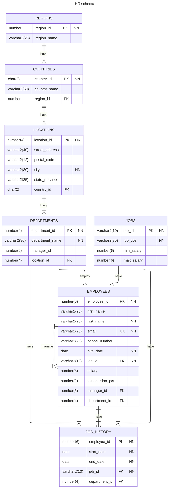

# Human Resources Sample Schema

## Schema Description

Human Resources (`HR`) is a small sample schema resembling an HR department.
In the Human Resource (`HR`) records, each employee has a
identification number, e-mail address, job identification code, salary,
and manager. Some employees earn commissions in addition to their salary.

The company also tracks information about jobs within the organization.
Each job has an identification code, job title, and a minimum and
maximum salary range for the job. Some employees have been with the
company for a long time and have held different positions within
the company. When an employee resigns, the duration the employee
was working, the job identification number, and the department are recorded.

The sample company is regionally diverse, so it tracks the locations of its
warehouses and departments. Each employee is assigned to a department, and
each department is identified either by a unique department number or a
short name. Each department is associated with one location, and each location
has a full address that includes the street name, postal code, city,
state or province, and the country code.

In places where the departments and warehouses are located, the company records
details such as the country name, currency symbol, currency name, and the
region where the country is located geographically.

## Install Instructions

1. Connect as privileged user with rights to create another user (`SYSTEM`, `ADMIN`, etc.)
2. Run the `hr_install.sql` script to create the `HR` (Human Resources) schema
3. You are prompted for:
   1. `password` - enter an Oracle Database compliant password
   2. `tablespace` - if you do not enter a tablespace, the default database tablespace is used

**Note:** If the HR schema already exists, it is removed/dropped and
a fresh HR schema is installed

### Dependencies and Requirements

- Oracle Database 19c and higher
- Access to `hr_install.sql`, `hr_create.sql`, `hr_populate.sql`, `hr_code.sql`
- Scripts need to be run as a privileged user with rights to create and drop another user (`SYSTEM`, `ADMIN`, etc.).

## Uninstall Instructions

1. Connect as privileged user with rights to create another user (`SYSTEM`, `ADMIN`, etc.)
2. Run the `hr_uninstall.sql ` script to remove the `HR` (Human Resources) schema

## Schema Details

### Schema Objects

| Object Type | Objects |
| ----------- | ------- |
| Index       | `country_c_id_pk`, `dept_id_pk`, `dept_location_ix`, `emp_department_ix`, `emp_email_uk`, `emp_emp_id_pk`, `emp_job_ix`, `emp_manager_ix`, `emp_name_ix`, `jhist_department_ix`, `jhist_employee_ix`, `jhist_emp_id_st_date_pk`, `jhist_job_ix`, `job_id_pk`, `loc_city_ix`, `loc_country_ix`, `loc_id_pk`, `loc_state_province_ix`, `reg_id_pk` |
| Procedure   | `add_job_history`, `secure_dml` |
| Sequence    | `departments_seq`, `employees_seq`, `locations_seq` |
| Table       | `countries`, `departments`, `employees`, `jobs`, `job_history`, `locations`, `regions` |
| Trigger     | `secure_employees`, `update_job_history` |
| View        | `emp_details_view` |

### Table Descriptions

#### `COUNTRIES`

| Name           | Null       | Type           | Relationships |
| -------------- | ---------- | -------------- | ------------- |
| `COUNTRY_ID`   | `NOT NULL` | `CHAR(2)`      | relates each row of the table `countries` to none or more rows in the table `locations` that have the corresponding values for `country_id`. |
| `COUNTRY_NAME` |            | `VARCHAR2(60)` | |
| `REGION_ID`    |            | `NUMBER`       | relates each row of the table `countries` to a row in the table `regions` that has the corresponding value for `region_id`.                  |

#### `DEPARTMENTS`

| Name              | Null       | Type           | Relationships |
| ----------------- | ---------- | -------------- | ------------- |
| `DEPARTMENT_ID`   | `NOT NULL` | `NUMBER(4)`    | relates each row of the table `departments` to none or more rows of the table `employees` that have corresponding values for `department_id`. |
| `DEPARTMENT_NAME` | `NOT NULL` | `VARCHAR2(30)` | |
| `MANAGER_ID`      |            | `NUMBER(6)`    | relates each row of the table `departments` to a row of the table `employees` that has the corresponding value for `employee_id`.             |
| `LOCATION_ID`     |            | `NUMBER(4)`    | relates each row of the table `departments` to a row of the table `locations` that has the corresponding value for `location_id`.             |

#### `EMPLOYEES`

| Name             | Null       | Type           | Relationships |
| ---------------- | ---------- | -------------- | ------------- |
| `EMPLOYEE_ID`    | `NOT NULL` | `NUMBER(6)`    | relates each row of the table `employees` to none or more rows of `employee_id` in the `job_history` table. |
| `FIRST_NAME`     |            | `VARCHAR2(20)` | |
| `LAST_NAME`      | `NOT NULL` | `VARCHAR2(25)` | |
| `EMAIL`          | `NOT NULL` | `VARCHAR2(25)` | |
| `PHONE_NUMBER`   |            | `VARCHAR2(20)` | |
| `HIRE_DATE`      | `NOT NULL` | `DATE`         | |
| `JOB_ID`         | `NOT NULL` | `VARCHAR2(10)` | relates each row of the table `employees` to exactly one value of `job_id` in the table `jobs`. |
| `SALARY`         |            | `NUMBER(8,2)`  | |
| `COMMISSION_PCT` |            | `NUMBER(2,2)`  | |
| `MANAGER_ID`     |            | `NUMBER(6)`    | references none or one other row of the `employees` table through a matching `employee_id`; note that a head of the company would typically not have a manager. |
| `DEPARTMENT_ID`  |            | `NUMBER(4)`    | relates each row of the table `employees` to exactly one value of `department_id` in the table `departments`. |

#### `JOBS`

| Name         | Null       | Type           | Relationships |
| ------------ | ---------- | -------------- | ------------- |
| `JOB_ID`     | `NOT NULL` | `VARCHAR2(10)` | relates each row of the table `jobs` to the corresponding values in the `jobs_id` column of the table `employees`; relates none or more rows of the table `jobs` to the corresponding values in the `jobs_id` column of the table `job_history`. |
| `JOB_TITLE`  | `NOT NULL` | `VARCHAR2(35)` | |
| `MIN_SALARY` |            | `NUMBER(6)`    | |
| `MAX_SALARY` |            | `NUMBER(6)`    | |

#### `JOB_HISTORY`

| Name            | Null       | Type           | Relationships |
| --------------- | ---------- | -------------- | ------------- |
| `EMPLOYEE_ID`   | `NOT NULL` | `NUMBER(6)`    | relates each row of the table `job_history` to the corresponding values in the `employees` through the employee_id. |
| `START_DATE`    | `NOT NULL` | `DATE`         | |
| `END_DATE`      | `NOT NULL` | `DATE`         | |
| `JOB_ID`        | `NOT NULL` | `VARCHAR2(10)` | |
| `DEPARTMENT_ID` |            | `NUMBER(4)`    | |

#### `LOCATIONS`

| Name             | Null       | Type           | Relationships |
| ---------------- | ---------- | -------------- | ------------- |
| `LOCATION_ID`    | `NOT NULL` | `NUMBER(4)`    | relates each row of the table `locations` to none or more rows of the table `departments` that have the corresponding values for `location_id`. |
| `STREET_ADDRESS` |            | `VARCHAR2(40)` | |
| `POSTAL_CODE`    |            | `VARCHAR2(12)` | |
| `CITY`           | `NOT NULL` | `VARCHAR2(30)` | |
| `STATE_PROVINCE` |            | `VARCHAR2(25)` | |
| `COUNTRY_ID`     |            | `CHAR(2)`      | |

#### `REGIONS`

| Name          | Null       | Type           | Relationships |
| ------------- | ---------- | -------------- | ------------- |
| `REGION_ID`   | `NOT NULL` | `NUMBER`       | relates rows of the table `regions` to none or more rows of the table `countries` that have the corresponding values for `region_id`. |
| `REGION_NAME` |            | `VARCHAR2(25)` | |

### Schema Diagram



## License

```
Copyright (c) 2023 Oracle and/or its affiliates. All rights reserved.

Permission is hereby granted, free of charge, to any person obtaining a
copy of this software and associated documentation files (the "Software"),
to deal in the Software without restriction, including without limitation
the rights to use, copy, modify, merge, publish, distribute, sublicense,
and/or sell copies of the Software, and to permit persons to whom the
Software is furnished to do so, subject to the following conditions:

The above copyright notice and this permission notice shall be included in
all copies or substantial portions rem of the Software.

THE SOFTWARE IS PROVIDED "AS IS", WITHOUT WARRANTY OF ANY KIND, EXPRESS OR
IMPLIED, INCLUDING BUT NOT LIMITED TO THE WARRANTIES OF MERCHANTABILITY,
FITNESS FOR A PARTICULAR PURPOSE AND NONINFRINGEMENT. IN NO EVENT SHALL
THE AUTHORS OR COPYRIGHT HOLDERS BE LIABLE FOR ANY CLAIM, DAMAGES OR OTHER
LIABILITY, WHETHER IN AN ACTION OF CONTRACT, TORT OR OTHERWISE, ARISING
FROM, OUT OF OR IN CONNECTION WITH THE SOFTWARE OR THE USE OR OTHER
DEALINGS IN THE SOFTWARE.
```
